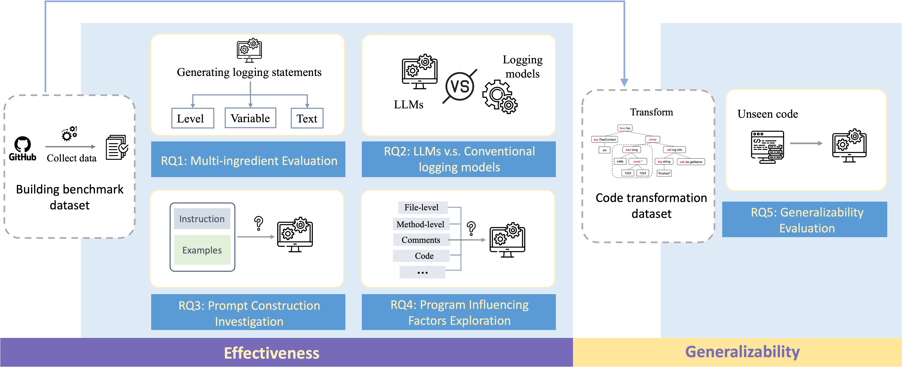

# LoggingStudy
LogBench is the benchmark for evaluating the performance of LLMs in logging statement generation. Here is the overview of the study:

We provide part of the code in the folder `/src`, We will make the full source code available after the paper has been accepted.

# Repository Organization 

```
├── LICENSE
├── LogBench-O
│   ├── LogBench-O_prefix_1point.zip
│   ├── LogBench-O_prefix_1point_file_level.zip
│   └── LogBench-O_prefix_1point_wo_comments.zip
├── LogBench-T
│   ├── LogBench-T_prefix_1point.zip
│   └── LogBench-T_prefix_1point_file_level.zip
├── README.md
├── build
│   └── code-transformer.jar
├── cases
│   └── generated_cases.csv
├── img
│   ├── overview.pdf
│   └── overview.png
└── src
    ├── Baselines
    │   ├── DeepLV
    │   ├── WhichVar
    │   ├── LogenText-Plus
    │   ├── StarCoder
    │   └── Lance
    │   └── InCoder
    │   └── ...
    ├── CodeTransformer
    │   └── README.md
    └── DataCollector
        ├── ...
```

# Study Objects
| Model        | Access | Year |
| ------------ | ------ | ---- |
| Davinci      | API    | 2022 |
| ChatGPT      | API    | 2022 |
| LANCE        | Model  | 2022 |
| InCoder      | Model  | 2022 |
| Llama2      | Model    | 2023 |
| StarCoder      | Model    | 2023 |
| CodeLlama      | Model    | 2023 |
| DeepLV      | Model    | 2021 |
| WhichVar      | Model    | 2021 |
| LoGenText-Plus      | Model    | 2023 |
| CodeGeex     | Plugin | 2022 |
| TabNine      | Plugin | 2022 |
| Copilot      | Plugin | 2021 |
| Code Whisperer | Plugin | 2022 |


# Benchmark Details
Currently LogBench contains two sub-dataset for evaluating the performance of current code/log generation models, namely LogBench-O and LogBench-T.
## LogBench-O
The folder `/LogBench-O` contains the sampled files of LogBench-O.
## LogBench-T
The folder `/LogBench-T` contains the sampled files of LogBench-T.
## Cases
Please refer to the `cases` folder for generated cases

# Download the Whole Collected Datasets
As GitHub does not hold large datasets, you can download the **whole** collected benchmark dataset LogBench-O-Fullsize at [here](https://drive.google.com/file/d/13EV-rIFEwVrLGnpNIcpF3u9NSOh_gCNM/view?usp=sharing)
(zip: 252M; unzip: 786M)


# Additional: Code Transformation Tool

The folder `/build` contains the built tranformation tool we developed. It will conduct the code tranformation automatically with the eight code transformers.
- To conduct the code transformation in batch.
```
java -jar code-transformer.jar -f ./files/
```
